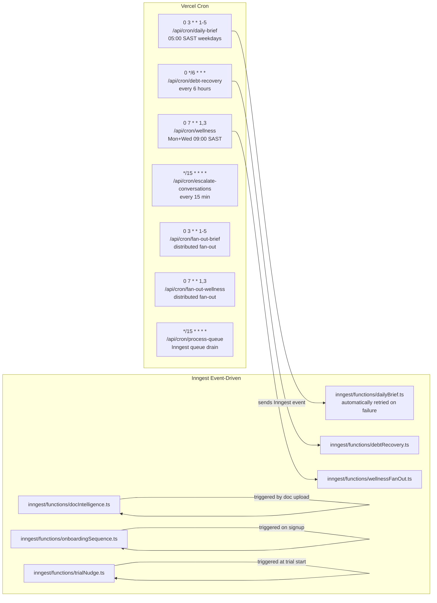
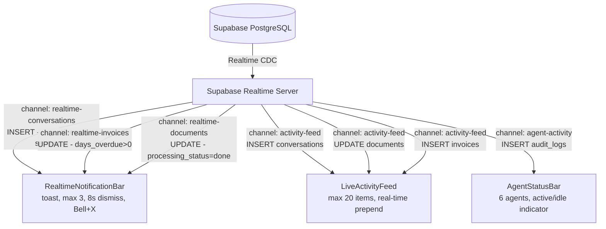

# AdminOS — System Design

> Last updated: April 2026 · Mirembe Muse (Pty) Ltd

---

## a) Full Architecture Diagram

### WhatsApp Inbound Request Lifecycle

```mermaid
flowchart TD
    A([User sends WhatsApp message]) --> B[Meta Business API\ngraph.facebook.com/v19.0]
    B -->|POST x-hub-signature-256| C[/api/webhook/whatsapp]
    C --> D{HMAC-SHA256\nverification}
    D -->|invalid| E([HTTP 401 — rejected])
    D -->|valid| F[parseMetaWebhookPayload]
    F --> G[sanitizeForAI\n17 injection patterns\n2000-char limit]
    G --> H[WorkflowEngine: whatsapp.inbound]

    H --> H1[loadTenantContext\nrebuild system prompt if >24h old]
    H1 --> H2[classifyIntent + classifySentiment\ndetectLanguage — Zulu/Xhosa/Afrikaans/EN]
    H2 --> H3[checkFAQCache\nUpstash Redis sliding window]
    H3 -->|cache hit| H5
    H3 -->|miss| H4[checkPlanLimits\nstarter=500 business=5000 enterprise=∞]
    H4 --> H5[generateResponse\ncallClaudeWithCache — Sonnet 4.6]
    H5 --> H6[sendWhatsApp\nMeta API — phoneNumberId/messages]
    H6 --> H7[logToAudit\nSupabase audit_log — append-only]
    H7 --> H8[updateDashboard\nconversations + messages upsert]
    H8 --> H9[recordWellness\nextract score 1-5, update staff.wellness_scores]
    H9 --> Z([Done])

    H8 -->|Supabase Realtime INSERT| RT[RealtimeNotificationBar\nurgent/negative sentiment toast]
```

### Email Inbound

```mermaid
flowchart LR
    EI([Inbound email]) --> EW[/api/webhook/email]
    EW --> EH{HMAC verify}
    EH --> WE[WorkflowEngine: email.inbound]
    WE --> EP[processEmail → Claude classify + respond]
    EP --> ES[Resend API — send reply]
```

### File Intelligence Pipeline

```mermaid
flowchart TD
    N8N([n8n automation]) -->|POST + N8N_WEBHOOK_SECRET| WF[/api/workflow/file-received]
    WF --> UP[/api/documents/upload]
    UP --> CL[classifyDocument — Claude Haiku]
    CL --> R1{doc_category}

    R1 -->|strategy| G1[extractGoals → goals table\nActive goals with progress tracking]
    R1 -->|invoice| G2[extractInvoiceData → invoices table\ncontact, amount, due_date]
    R1 -->|hr| G3[updateStaffRecord → staff table\nleave, role, department]
    R1 -->|report| G4[summariseReport → dashboard\nai_summary stored on documents]
    R1 -->|contract| G5[extractContractTerms → documents\nkey dates, obligations, parties]

    G1 & G2 & G3 & G4 & G5 --> AU[writeAuditLog]
    AU --> RT2([Supabase Realtime UPDATE → LiveActivityFeed])
```

### Scheduled Jobs — Two Systems



### Real-Time Dashboard



---

## b) Multi-Tenant Architecture

```mermaid
flowchart TD
    subgraph Browser
        BC[supabaseClient\n@supabase/ssr\nanon key]
    end

    subgraph Server / Edge
        SC[supabaseServer\n@supabase/ssr\nanon key + cookies]
        SA[supabaseAdmin\n@supabase/supabase-js\nservice_role key — BYPASSES RLS]
    end

    subgraph Supabase
        direction TB
        RLS[Row-Level Security\nENFORCED on all user tables]
        NORLS[audit_log\nappend-only — UPDATE/DELETE revoked]
        WQ[workflow_queue\nstatus: pending/processing/completed/failed]
    end

    BC -->|respects RLS| RLS
    SC -->|respects RLS| RLS
    SA -->|BYPASSES RLS| RLS
    SA -->|BYPASSES RLS| NORLS
    SA -->|BYPASSES RLS| WQ

    subgraph "supabaseAdmin callers (server-only)"
        CR[Cron routes]
        WH[Webhook handlers]
        BW[Billing webhooks]
        IW[Inngest workers]
        WE[WorkflowEngine]
    end

    subgraph "supabaseClient / supabaseServer callers"
        DS[Dashboard pages\nServer Components]
        API[Dashboard API routes\n/api/contacts, /api/documents]
    end
```

### RLS Policy Pattern (every user-facing table)

```sql
-- SELECT
CREATE POLICY "tenant_isolation_select"
ON public.<table> FOR SELECT
USING (tenant_id = (auth.jwt() ->> 'tenant_id')::uuid);

-- INSERT / UPDATE
CREATE POLICY "tenant_isolation_modify"
ON public.<table> FOR INSERT
WITH CHECK (tenant_id = (auth.jwt() ->> 'tenant_id')::uuid);
```

### Middleware Header Injection

Every authenticated request receives these headers before hitting any API route:

| Header | Value | Source |
|--------|-------|--------|
| `x-tenant-id` | UUID from JWT user_metadata | middleware.ts |
| `x-user-id` | Supabase auth user ID | middleware.ts |
| `x-user-role` | `owner` / `admin` / `staff` / `super_admin` | middleware.ts |

> **Footgun warning:** `supabaseAdmin` bypasses RLS by design. Any developer touching cron routes, webhook handlers, or Inngest functions must be aware they are operating across ALL tenants. Always scope queries with `.eq('tenant_id', tenantId)` manually when using `supabaseAdmin`.
>
> `agents.ts` uses `supabaseAdmin` — it is **server-only**. Never import it in `'use client'` components. Use `agents.config.ts` instead.

---

## c) AI Cost Architecture

| Agent | Name | Model | Trigger | Caches? | Est. tokens/request |
|-------|------|-------|---------|---------|-------------------|
| Inbox Agent | Alex | claude-sonnet-4-6 | WhatsApp inbound | Yes | ~2,000 |
| Debt Recovery Agent | Chase | claude-haiku-4-5-20251001 | Cron / overdue trigger | Yes | ~800 |
| Wellness Agent | Care | claude-sonnet-4-6 | Scheduled check-in | Yes | ~600 |
| Document Intelligence | Doc | claude-haiku-4-5-20251001 | File upload | Yes | ~3,000 |
| Analytics / Brief | Insight | claude-haiku-4-5-20251001 | Dashboard request / daily cron | Yes | ~1,000 |
| Email Agent | Pen | claude-sonnet-4-6 | Dashboard compose | Yes | ~1,500 |

### Prompt Caching Strategy

```typescript
// Every system prompt block uses cache_control: ephemeral
{
  type: 'text',
  text: buildSystemPrompt(tenant),
  cache_control: { type: 'ephemeral' }
}
```

- **Target:** >80% cache hit rate — monitor in Anthropic usage dashboard
- **History cap:** 10 messages per conversation to bound token cost
- **Multi-model routing:** Sonnet for customer-facing and emotionally nuanced agents; Haiku for structured/scheduled tasks — ~60–70% cost reduction
- **FAQ cache layer:** Short questions (<150 chars) with short responses (<300 chars) are stored in Upstash Redis. Cache hit = zero Claude tokens consumed

---

## d) Database Schema ERD

```mermaid
erDiagram
    tenants {
        uuid id PK
        text name
        text slug
        text plan
        text whatsapp_number
        text business_type
        text country
        jsonb settings
        text system_prompt_cache
        timestamp prompt_cached_at
        bool active
        timestamp created_at
    }

    users {
        uuid id PK
        uuid tenant_id FK
        text email
        text role
        bool onboarding_completed
        bool suspended
        text plan
        timestamp trial_expired_at
        timestamp created_at
    }

    conversations {
        uuid id PK
        uuid tenant_id FK
        text channel
        text contact_name
        text contact_identifier
        text contact_type
        text status
        text sentiment
        text intent
        text summary
        timestamp created_at
        timestamp updated_at
    }

    messages {
        uuid id PK
        uuid tenant_id FK
        uuid conversation_id FK
        text role
        text content
        text channel
        int tokens_used
        bool from_cache
        timestamp created_at
    }

    contacts {
        uuid id PK
        uuid tenant_id FK
        text name
        text phone
        text email
        text type
        jsonb metadata
        timestamp created_at
    }

    staff {
        uuid id PK
        uuid tenant_id FK
        text full_name
        text phone
        text email
        text role
        text department
        int leave_balance
        int leave_taken
        jsonb wellness_scores
        bool after_hours_flag
        timestamp created_at
    }

    leave_requests {
        uuid id PK
        uuid tenant_id FK
        uuid staff_id FK
        date start_date
        date end_date
        int days
        text reason
        text status
        uuid approved_by
        timestamp approved_at
        timestamp created_at
    }

    invoices {
        uuid id PK
        uuid tenant_id FK
        text contact_name
        text contact_phone
        text contact_email
        numeric amount
        numeric amount_paid
        date due_date
        int days_overdue
        text status
        int escalation_level
        timestamp last_reminder_at
        text xero_invoice_id
        timestamp created_at
    }

    documents {
        uuid id PK
        uuid tenant_id FK
        text original_filename
        text file_type
        text storage_url
        text extracted_text
        text doc_category
        text ai_summary
        jsonb extracted_goals
        text processing_status
        uuid uploaded_by
        timestamp created_at
    }

    goals {
        uuid id PK
        uuid tenant_id FK
        text title
        text description
        text quarter
        text target_metric
        numeric current_value
        numeric target_value
        numeric progress_pct
        text status
        timestamp created_at
    }

    audit_log {
        uuid id PK
        uuid tenant_id FK
        text actor
        text action
        text resource_type
        uuid resource_id
        jsonb metadata
        text ip_address
        timestamp created_at
    }

    business_insights {
        uuid id PK
        uuid tenant_id FK
        text insight
        text category
        timestamp extracted_at
    }

    faqs {
        uuid id PK
        uuid tenant_id FK
        text question
        text answer
        int hit_count
        timestamp created_at
    }

    subscriptions {
        uuid id PK
        uuid tenant_id FK
        text plan
        text status
        text payfast_subscription_id
        timestamp current_period_end
        timestamp created_at
    }

    referrals {
        uuid id PK
        uuid tenant_id FK
        text referral_code
        uuid referred_tenant_id FK
        text status
        timestamp created_at
    }

    workflow_queue {
        uuid id PK
        uuid tenant_id FK
        text event_type
        jsonb payload
        text status
        int retries
        text error
        timestamp scheduled_at
        timestamp processed_at
        timestamp created_at
    }

    tenants ||--o{ users : "has many"
    tenants ||--o{ conversations : "has many"
    tenants ||--o{ staff : "has many"
    tenants ||--o{ invoices : "has many"
    tenants ||--o{ documents : "has many"
    tenants ||--o{ goals : "has many"
    tenants ||--o{ audit_log : "has many"
    tenants ||--o{ business_insights : "has many"
    tenants ||--o{ subscriptions : "has one"
    tenants ||--o{ workflow_queue : "has many"
    conversations ||--o{ messages : "has many"
    staff ||--o{ leave_requests : "has many"
```



### RLS Status Summary

| Table | RLS | Notes |
|-------|-----|-------|
| tenants | admin-only | Only supabaseAdmin reads cross-tenant |
| users | enforced | tenant_id scoped via JWT |
| conversations | enforced | tenant_id scoped |
| messages | enforced | tenant_id scoped |
| contacts | enforced | tenant_id scoped |
| staff | enforced | tenant_id scoped |
| leave_requests | enforced | tenant_id scoped |
| invoices | enforced | tenant_id scoped |
| documents | enforced | tenant_id scoped |
| goals | enforced | tenant_id scoped |
| audit_log | append-only | UPDATE + DELETE revoked at DB level — immutable |
| business_insights | enforced | tenant_id scoped |
| faqs | enforced | tenant_id scoped |
| subscriptions | enforced | tenant_id scoped |
| referrals | enforced | tenant_id scoped |
| workflow_queue | admin-only | Inngest workers use supabaseAdmin |

---

## e) Rate Limiting Architecture

All limiters use **Upstash Redis sliding window**. Identifier format: `{prefix}:{tenant_id}`.

| Limiter key | Prefix | Limit | Window | Use case |
|-------------|--------|-------|--------|----------|
| `whatsapp` | `rl:wa` | 30 req | 10 s | Per-tenant WhatsApp inbound |
| `api` | `rl:api` | 60 req | 60 s | General dashboard API |
| `agents` | `rl:agent` | 20 req | 60 s | Claude agent calls |
| `webhook` | `rl:wh` | 100 req | 1 s | High-volume webhook inbound |
| `onboarding` | `rl:onb` | 10 req | 3600 s | Prevent signup abuse |

### Fail-Open Behaviour

```typescript
// lib/security/rateLimit.ts
} catch {
  // If Redis is unavailable, fail open — never block production traffic
  console.error('[RateLimit] Redis unavailable — failing open')
  return { success: true, remaining: 0, reset: 0 }
}
```

If Upstash Redis becomes unavailable, all rate limit checks return `success: true`. The failure is logged but requests are never blocked. This is intentional — a Redis outage must not cause a production outage.

---

## f) PWA / Offline Architecture

Load shedding in South Africa runs 4–12 hours per day. AdminOS is a PWA specifically designed to remain usable offline.

### Service Worker (next-pwa, generated at /public/sw.js)

Configured via `next.config.ts` `withPWA()`:

| Route pattern | Strategy | Cache name | Notes |
|---------------|----------|------------|-------|
| `*.supabase.co/*` | NetworkFirst | supabase-api | 5-min cache, 5s network timeout |
| `/_next/static/*` | CacheFirst | next-static | 1-year cache (content-hashed) |
| `adminos.co.za/dashboard*` | NetworkFirst | dashboard-pages | 1h cache, 10s timeout → falls back to cache |

### Offline Fallback Behaviour

1. User opens AdminOS dashboard during load shedding (no connectivity)
2. Service worker intercepts request to `/dashboard/*`
3. Network request times out after 10 seconds
4. Cached version of dashboard shell is served from `dashboard-pages` cache
5. Supabase Realtime channels disconnect gracefully
6. User can still view previously loaded data from the dashboard shell cache

### PWA Manifest Shortcuts

Defined in `/public/manifest.json`:

```json
{
  "theme_color": "#0A0F2C",
  "shortcuts": [
    { "name": "Inbox", "url": "/dashboard/inbox" },
    { "name": "Invoices", "url": "/dashboard/invoices" },
    { "name": "Documents", "url": "/dashboard/documents" }
  ]
}
```

---

## g) Real-Time Dashboard Architecture

Three React components power the live dashboard experience, all using `createClient()` (anon key, RLS-scoped).

### RealtimeNotificationBar

**File:** `components/dashboard/RealtimeNotificationBar.tsx`

| Supabase channel | Event | Table | Trigger condition |
|------------------|-------|-------|-------------------|
| `realtime-conversations` | INSERT | conversations | `sentiment = 'urgent'` or `sentiment = 'negative'` |
| `realtime-invoices` | UPDATE | invoices | `days_overdue > 0 AND status = 'unpaid'` |
| `realtime-documents` | UPDATE | documents | `processing_status = 'done'` |

- Max simultaneous notifications: **3** (older ones replaced)
- Auto-dismiss after: **8 seconds**
- Icons: Bell (🔔) for notification, X to dismiss
- Toast colours: amber (warning), emerald (success), white (info)
- Position: fixed, top-right, z-50

### LiveActivityFeed

**File:** `components/dashboard/LiveActivityFeed.tsx`

Single Supabase channel `activity-feed` with 3 event listeners:

| Event | Table | Icon | Colour |
|-------|-------|------|--------|
| INSERT | conversations | MessageSquare | blue-500 |
| UPDATE (done) | documents | FileText | purple-500 |
| INSERT | invoices | Receipt | amber-500 |

- Initial items: server-fetched and passed as `initial` prop (SSR-first)
- Max items in feed: **20** (oldest dropped)
- Times displayed in `en-ZA` locale (24h format)

### AgentStatusBar

**File:** `components/dashboard/AgentStatusBar.tsx`

Subscribes to `audit_logs` INSERT events via channel `agent-activity`. When an audit log action contains an agent's key name, that agent flips from idle → active.

| Agent key | Label | Description |
|-----------|-------|-------------|
| `alex` | Alex | Sales / inbox |
| `chase` | Chase | Debt recovery |
| `care` | Care | Support / wellness |
| `doc` | Doc | Documents |
| `insight` | Insight | Analytics |
| `pen` | Pen | Email compose |

- Active indicator: gold dot (`#C9A84C`) on dark green background (`#2D4A22`)
- Idle: grey dot on `bg-gray-100`
- No debounce — state is live, no polling
